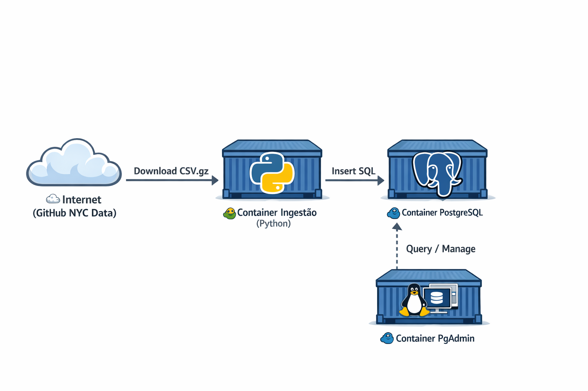

# Pipeline de Ingestão de Dados - NYC Taxi

Este projeto consiste em um pipeline simples para ingestão de dados de corridas de táxi de Nova York (NYC TLC Data) em um banco de dados PostgreSQL, utilizando containers Docker.

## 📋 Funcionalidades

- **Download Automático**: Baixa arquivos CSV comprimidos do repositório oficial.
- **Ingestão em Lote**: Processa e insere os dados no banco PostgreSQL em chunks de 100.000 registros para eficiência.
- **Infraestrutura**: Configuração via Docker Compose para o banco de dados e interface de gerenciamento (pgAdmin).

## 🛠️ Tecnologias

- **Python 3.13** (com Pandas, SQLAlchemy, Click)
- **Docker** & **Docker Compose**
- **PostgreSQL 18**
- **pgAdmin 4**
- **uv** (Gerenciador de pacotes Python)

## 🛠️ Arquitetura do Pipeline



## 🚀 Como Executar

### 1. Subir o Banco de Dados

Na pasta `pipeline`:

```bash
docker-compose up -d
```

Isso iniciará o PostgreSQL (porta 5432) e o pgAdmin (porta 8085).

### 2. Executar a Ingestão

Você pode rodar o script localmente ou via Docker.

**Via Docker (Recomendado):**

Construa a imagem:

```bash
docker build -t taxi-ingest ./pipeline
```

Execute o container conectado à rede do banco:

```bash
docker run -it \
  --network pg-network \
  taxi-ingest \
  --year 2021 \
  --month 1 \
  --pg-host pgdatabase \
  --pg-password root
```

**Parâmetros disponíveis:**

- `--year`: Ano dos dados (ex: 2021)
- `--month`: Mês dos dados (ex: 1)
- `--pg-host`: Host do banco (use `pgdatabase` dentro da rede docker, ou `localhost` se rodar localmente)
- `--pg-user`, `--pg-password`, `--pg-db`: Credenciais do banco (padrão: root/root/ny_taxi)

### 3. Verificar os Dados

Acesse o pgAdmin em [http://localhost:8085](http://localhost:8085).

- **Login**: `admin@admin.com`
- **Senha**: `root`
- **Host do Servidor (dentro do pgAdmin)**: `pgdatabase`
